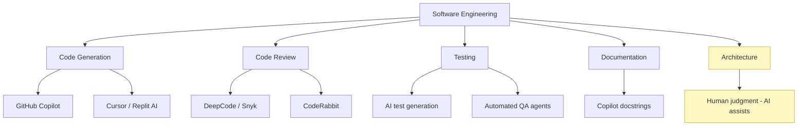

# Sample Answer — Module 01
## Assignment: AI Impact Reflection

**Brief:** Write a 300-word reflection on how AI will impact your chosen career in the next 5 years.

10 marks

---

<h4>📄 Model Answer — Software Engineering Student</h4>

**Career field:** Software Engineering

Artificial Intelligence is already reshaping how software is built, and the pace of change is accelerating. As a final-year software engineering student, I can see clearly how AI will transform my career over the next five years — not by replacing me, but by fundamentally changing the nature of my work.

**Two AI applications already in use in software engineering:**

First, AI coding assistants like GitHub Copilot are now standard tools in professional development. They autocomplete code, generate boilerplate, suggest tests, and explain unfamiliar APIs — tasks that previously consumed a significant portion of a developer's day. Second, AI-powered code review tools such as DeepCode and Snyk use ML to identify security vulnerabilities and code quality issues far faster than manual review processes.

**One emerging capability in the next five years:**

I predict that autonomous AI agents will be capable of completing entire development tasks end-to-end — accepting a specification, writing the code, running tests, fixing errors, and submitting a pull request — with minimal human involvement for well-defined features. Tools like Devin (Cognition AI) are early demonstrations of this trajectory.

**Opportunity or threat?**

I see this primarily as an opportunity. AI automates the repetitive, mechanical parts of coding — scaffolding, documentation, simple bug fixes. This frees engineers to focus on architecture, product thinking, and the creative problem-solving that AI still cannot replicate. However, it is a genuine threat to developers who do not adapt — those who resist learning to work effectively with AI tools will find themselves less competitive.

**Skill I will develop:** I will deepen my knowledge of prompt engineering for code generation, and learn to critically evaluate AI-generated code for correctness, security, and efficiency.

---

## How This Answer Scores

| Criteria | Marks | What this answer does |
|----------|-------|-----------------------|
| Career field identified | 1 | Named clearly in opening |
| Two current AI applications | 3 | GitHub Copilot + AI code review — specific tools named |
| Future prediction | 2 | Autonomous agents, with a real example (Devin) |
| Personal stance argued | 2 | Opportunity argued with clear reasoning |
| Writing quality | 2 | Structured, clear, 300 words |
| **Total** | **10** | |

---

## AI in Software Engineering — Landscape Diagram

AI tools in modern software engineering — yellow = still primarily human domain

---

<strong>💡 Examiner Tip:</strong> The strongest answers name specific AI tools (not just "AI in general"), give a reasoned personal stance, and connect the future prediction to evidence — a current prototype, research paper, or product announcement. Generic answers that say "AI will change everything" without specifics score in the C range.

