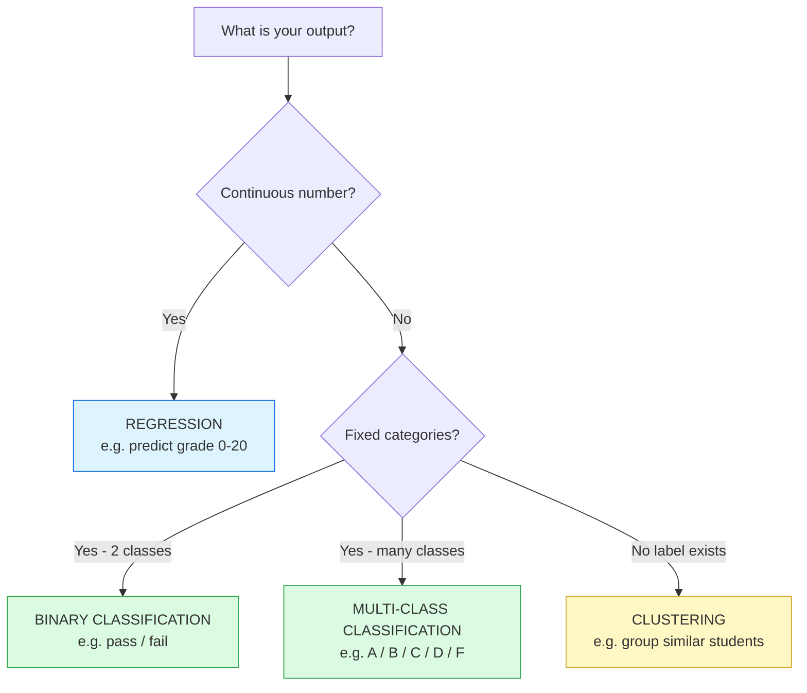
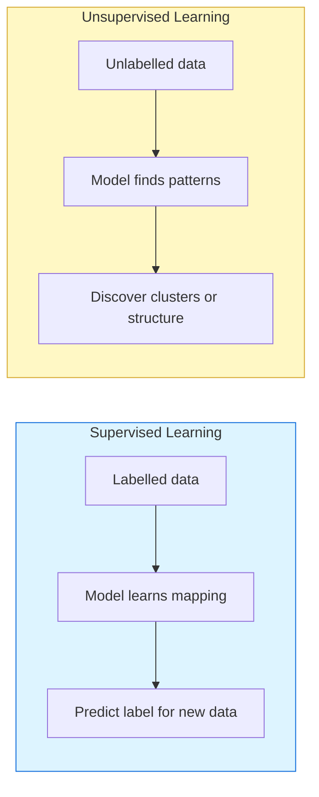

# Sample Answer — Module 02
## Assignment: Dataset Analysis

**Brief:** Analyse a publicly available dataset — identify features, label, ML problem type, real-world application, and one bias risk.

10 marks

---

<h4>📄 Model Answer — Student Performance Dataset</h4>

**Dataset:** Student Performance Dataset — UCI Machine Learning Repository

**Source:** Kaggle / UCI &nbsp;|&nbsp; **Rows:** 649 students &nbsp;|&nbsp; **Columns:** 33 attributes

---

### Features (Inputs)

| Feature | Type | Description |
|---------|------|-------------|
| study_time | Numeric | Weekly study hours (1–4 scale) |
| failures | Numeric | Number of past class failures |
| absences | Numeric | Number of school absences |
| parental_education | Categorical | Mother/father education level |
| internet | Binary | Internet access at home |
| free_time | Numeric | Free time after school |

**Label (output):** `G3` — Final grade (0–20 numeric scale)

---

### ML Problem Type

**Regression** — predicting a continuous numeric grade.

Could also be framed as **classification** (pass/fail, or grade band A/B/C/D/F) depending on the use case.

---

### Real-World Application

An early warning system for college tutors — flagging students at risk of failing before final exams so targeted support can be offered. If the model predicts a student will score below 10, a tutor is automatically notified to schedule a check-in.

---

### Bias Risk

Parental education level is a significant predictor in this dataset. Students whose parents have lower education levels are statistically more likely to receive lower predictions — not because of their own ability, but because of socioeconomic factors beyond their control. A model trained on this data could perpetuate disadvantage by routing fewer resources to students who need the most support.

---

## How This Answer Scores

| Criteria | Marks | What this answer does |
|----------|-------|-----------------------|
| Dataset described accurately | 2 | Source, size, and context given |
| Features and label identified | 2 | Table of features + label named |
| ML problem type with reasoning | 2 | Regression explained, classification alternative noted |
| Real-world application | 2 | Specific, plausible early warning system |
| Bias risk identified | 2 | Parental education bias — specific and explained |
| **Total** | **10** | |

---

## ML Problem Type Decision Diagram

Use this decision tree to choose the right ML problem type for any dataset

---

## Supervised vs Unsupervised — Visual Summary

Student Performance uses Supervised Learning — the label (grade) is known

---

**💡 Examiner Tip:** Many students correctly identify the ML type but fail to explain *why*. Always justify — "this is regression *because* the output is a continuous number, not a category." The bias risk answer should name a specific feature, not just say "the data could be biased."

