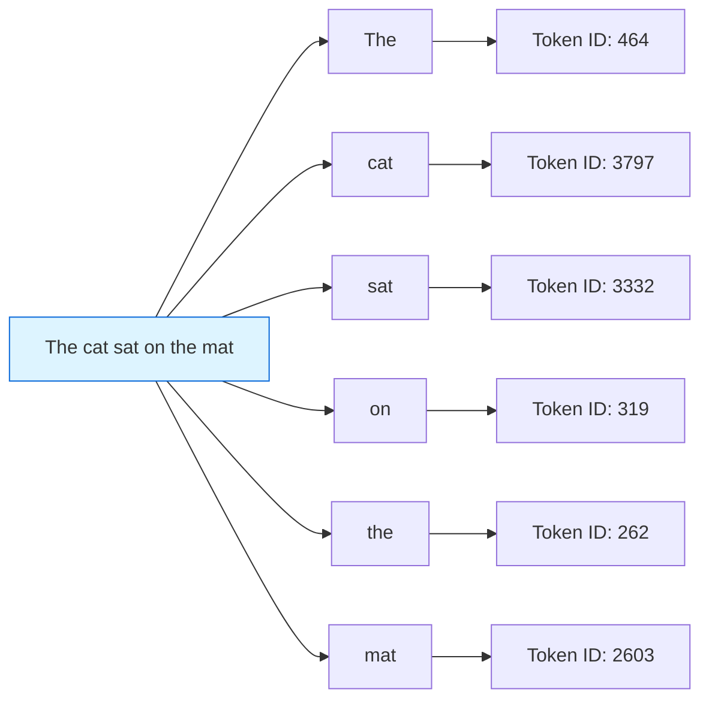
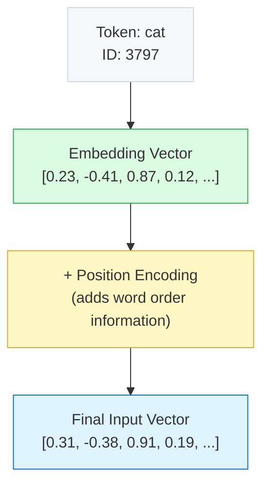
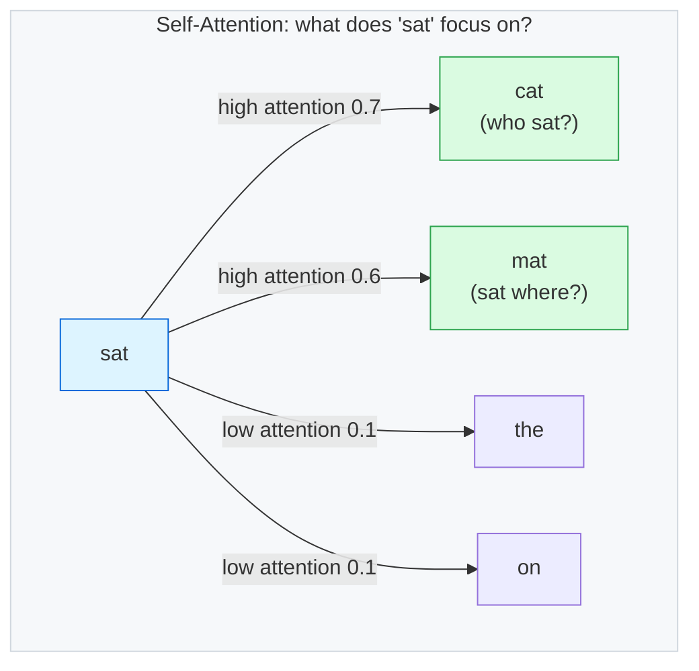
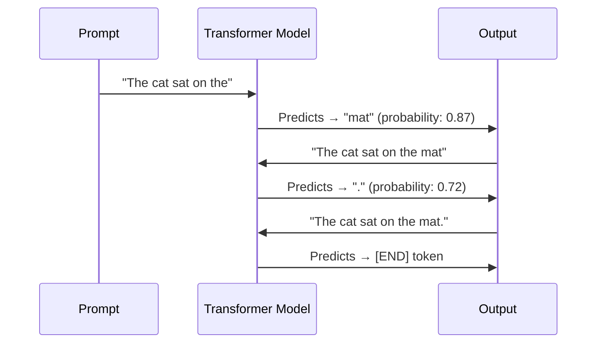
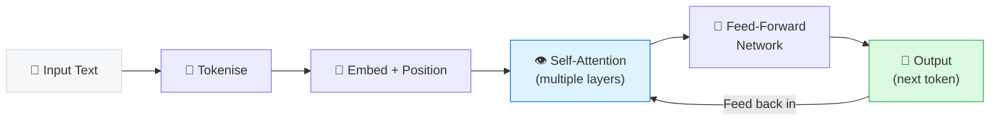

# Sample Answer — Module 03
## Assignment: Neural Network Explainer

**Brief:** Create a one-page visual explainer showing how a Transformer model processes a sentence.

10 marks

---

<h4>📄 Model Answer — How a Transformer Processes "The cat sat on the mat"</h4>

A Transformer model processes text in four main stages: tokenisation, embedding, attention, and output generation. Here is how the sentence **"The cat sat on the mat"** flows through the model.

---

## Stage 1 — Tokenisation

The sentence is split into **tokens** — the basic units the model processes. Each token is roughly 3–4 characters or one short word.

Each word becomes a numeric token ID that the model can process mathematically

---

## Stage 2 — Embeddings

Each token ID is converted into a **vector** — a list of hundreds of numbers that captures its meaning. Similar words have similar vectors.

Without position encoding, the model would treat "cat sat" and "sat cat" identically

---

## Stage 3 — Attention Mechanism

The **attention mechanism** is the key innovation of Transformers. Every token looks at every other token and decides how much to "pay attention" to it when building its representation.

Attention scores show which words are most relevant to understanding each token in context

---

## Stage 4 — Output Generation

After attention, the model predicts the most likely next token one at a time.

Token-by-token generation — each prediction feeds back as input for the next

---

## Full Pipeline Summary

The Transformer processes all tokens in parallel (unlike RNNs) — making it dramatically faster to train

---

## How This Answer Scores

| Criteria | Marks | What this answer does |
|----------|-------|-----------------------|
| Diagram accurate and labelled | 4 | 5 diagrams covering all 4 stages |
| Explanation in student's own words | 3 | Plain language throughout |
| Attention mechanism correct | 2 | Shows which tokens attend to which |
| Presentation clear | 1 | Structured with captions |
| **Total** | **10** | |

---

<strong>💡 Examiner Tip:</strong> Many students draw a generic "input → hidden layers → output" neural network diagram and call it a Transformer. That scores 2/4 for the diagram at best. The Transformer is distinguished by the <em>attention mechanism</em> — your explainer must show how tokens relate to each other, not just how data flows through layers.

