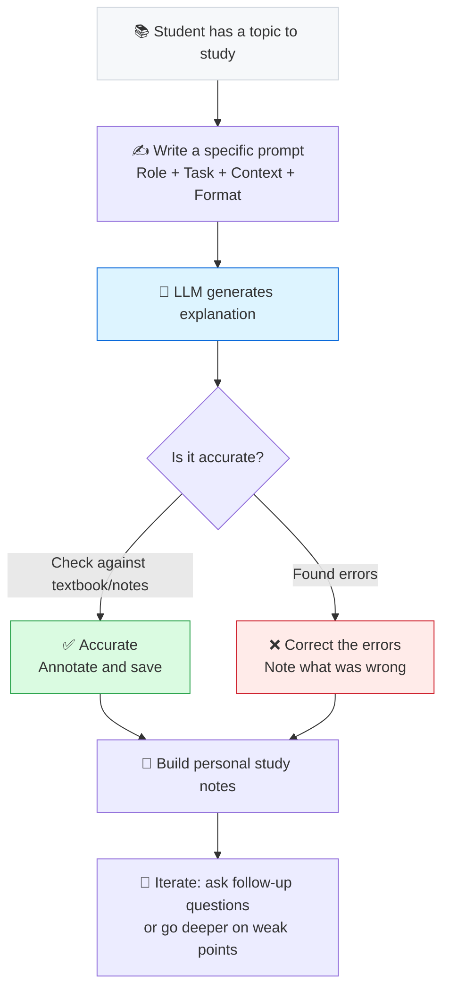

# Sample Answer — Module 04
## Assignment: AI Study Assistant

**Brief:** Use an LLM to build a study assistant for one subject. Document 5 prompts, one full output, edits made, a hallucination check, and a usefulness rating.

10 marks

---

<h4>📄 Model Answer — Study Assistant for Data Structures (CS)</h4>

**Subject:** Data Structures and Algorithms
**Tool used:** ChatGPT (GPT-4o)

---

## 5 Documented Prompts

| # | Purpose | Prompt |
|---|---------|--------|
| 1 | Concept explanation | "You are a CS tutor. Explain binary search trees to a second-year student in simple terms. Use an analogy. Max 150 words." |
| 2 | Practice questions | "Generate 5 short-answer exam questions on linked lists, ranging from easy to hard. Include a one-line answer for each." |
| 3 | Compare concepts | "Compare arrays and linked lists in a table covering: memory allocation, access time, insertion time, and best use case." |
| 4 | Exam summary | "Summarise the key things I need to know about graph traversal (BFS and DFS) for an exam. Use bullet points." |
| 5 | Explain complexity | "Explain Big O notation as if you're explaining it to someone who has never written code. Use a real-world analogy." |

---

## Full Output — Prompt 1

**Prompt sent:**
> "You are a CS tutor. Explain binary search trees to a second-year student in simple terms. Use an analogy. Max 150 words."

**AI Output (verbatim):**

> A Binary Search Tree (BST) is like a well-organised library where every book is shelved in alphabetical order — but instead of a flat shelf, imagine a branching tree structure.
>
> At the top is the **root node** (the first book added). Every node has up to two "children." All books (values) to the **left** are smaller than the parent; all to the **right** are larger.
>
> To find a book, you start at the root: if your book comes before it alphabetically, go left. If after, go right. Repeat until you find it — or discover it's not there.
>
> This structure makes **searching very efficient**: instead of checking every book, you eliminate half the options at each step. With a balanced tree of 1,000 books, you find any book in just 10 comparisons.

---

## Edits Made

| Edit | Reason |
|------|--------|
| Added "This is called O(log n) time complexity" after the last sentence | The AI's analogy was good but didn't connect to the formal concept students need for exams |
| Changed "alphabetically" to "by value" in paragraph 1 | BSTs sort by numeric/comparable value, not literally alphabetically — more accurate |
| Added a note: "A BST becomes unbalanced if you insert sorted data — look up AVL trees for the solution" | Important exam point the AI omitted |

---

## Hallucination Check

**Claim checked:** "With a balanced tree of 1,000 books, you find any book in just 10 comparisons."

**Verification:** log₂(1000) = 9.97 ≈ 10. ✅ **Correct.**

**Second check:** Asked the AI to explain AVL trees and it described the rotation rules. Cross-checked against the course textbook — the description was accurate.

**No hallucinations detected** in this output. Note: hallucinations are more common when asking about specific people, recent events, or obscure niche topics.

---

## Usefulness Rating: 8/10

The AI produced accurate, well-structured explanations with good analogies. It saved approximately 30 minutes of reading time for the concept review. The main limitation was that it sometimes omitted the formal terminology needed for exam answers — human editing was required to add precision. I would not submit the raw output as a study note without review, but as a first draft it was excellent.

---

## How AI Study Assistants Work — Flow Diagram

Always verify AI study content before treating it as ground truth

---

## How This Answer Scores

| Criteria | Marks | What this answer does |
|----------|-------|-----------------------|
| 5 prompts documented | 3 | Table with purpose + exact prompt text |
| One full output included | 1 | Verbatim AI response shown |
| Edits documented with reasons | 3 | 3 edits with clear reasoning |
| Hallucination check | 2 | Two claims verified, one mathematically |
| Usefulness rating with reasoning | 1 | 8/10 with specific justification |
| **Total** | **10** | |

---

<strong>💡 Examiner Tip:</strong> The hallucination check is where most students lose marks — they write "I checked and it was correct" without showing <em>how</em> they verified it. Show your working: quote the claim, explain how you verified it (textbook page, calculation, external source), and state the result.

