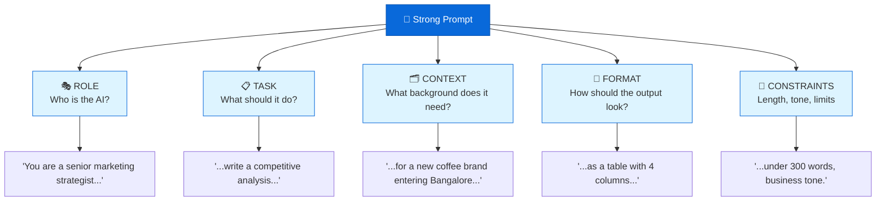

# Sample Answer — Module 05
## Assignment: Prompt Engineering Cheat Sheet

**Brief:** Create a prompt engineering cheat sheet for your discipline — covering the 5 elements of a strong prompt, weak vs strong examples, three techniques, your top 5 prompts, and one anti-pattern.

<span class="marks-badge">10 marks</span>

---

<div class="sample-answer">
<h4>📄 Model Answer — Prompt Engineering for Business Students</h4>
</div>

---

## The 5 Elements of a Strong Prompt


<p class="diagram-caption">Every strong prompt answers: Who? What? What context? What format? What limits?</p>

---

## Prompt Template

```
You are a [ROLE with specific expertise].
[TASK — the specific action you want].
[CONTEXT — background the AI needs to do it well].
Format the output as [FORMAT].
[CONSTRAINTS: length, tone, audience, language].
```

---

## Weak vs Strong Prompt

| | Prompt | Problem / Improvement |
|-|--------|----------------------|
| ❌ **Weak** | "Write a business plan" | No context, no audience, no format, no constraints — output will be generic and unusable |
| ✅ **Strong** | "You are a startup advisor. Write a 1-page executive summary for a food delivery app targeting college students in tier-2 Indian cities. Include: problem, solution, target market, revenue model, and competitive advantage. Professional tone, under 400 words." | Role + task + context + format + constraints — output is immediately usable |

---

## Three Techniques Demonstrated

### 1. Zero-Shot Prompting
No examples given — relies on the model's pre-trained knowledge.

**Prompt:** *"Classify this customer review as Positive, Negative, or Neutral: 'The product arrived on time but the packaging was damaged.'"*

**Output:** Neutral — acknowledges a positive aspect (on time) and a negative (packaging), with no strong overall sentiment.

---

### 2. Few-Shot Prompting
Provide 2–3 examples to set the pattern before your actual request.

**Prompt:**
```
Classify each review:
"Absolutely loved it!" → Positive
"Worst purchase ever." → Negative
"It's okay, nothing special." → Neutral

Now classify: "Fast delivery but the colour was different from the photo."
```
**Output:** Neutral (correctly identifies mixed sentiment)

---

### 3. Chain-of-Thought Prompting
Ask the AI to reason step by step — much better for analysis tasks.

**Prompt:** *"A company has revenue of ₹50L, COGS of ₹30L, and operating expenses of ₹12L. Think step by step: what is the gross profit, operating profit, and gross margin percentage?"*

**Output:** Gross profit = ₹20L → Operating profit = ₹8L → Gross margin = 40%. The step-by-step reasoning is transparent and verifiable.

---

## Top 5 Prompts for Business Students

| # | Use Case | Prompt |
|---|---------|--------|
| 1 | Case study analysis | "You are a business strategy consultant. Analyse this case study using Porter's Five Forces. Present each force as a separate section with a 2–3 sentence assessment." |
| 2 | Market research | "You are a market research analyst. Summarise the key trends in [industry] in India for 2025–2026. Focus on: consumer behaviour, technology adoption, and regulatory changes. Use bullet points." |
| 3 | Financial summary | "Explain the key financial ratios from this income statement to a first-year MBA student. Use simple language and one real-world interpretation for each ratio." |
| 4 | Presentation outline | "Create a 7-slide presentation outline on [topic] for a 10-minute pitch to investors. Include the key message and 2–3 talking points per slide." |
| 5 | Email drafting | "You are a professional business writer. Draft a follow-up email to a potential client I met at a networking event last week. Reference our conversation about [topic]. Professional but warm. Under 120 words." |

---

## One Prompt Anti-Pattern to Avoid

**Anti-Pattern: The Vague Ask**

> ❌ "Help me with my assignment"

**Why it fails:** The AI has no idea what your assignment is, what subject it's for, what format is needed, or what level of depth is expected. The output will be generic and require complete rewriting.

**Fix it:**
> ✅ "You are a business communications tutor. I have an assignment asking me to write a 500-word analysis of Apple's marketing strategy using the 4Ps framework. Give me an outline with 3 bullet points under each P, and suggest one real example for each. My audience is a first-year marketing lecturer."

---

## How This Answer Scores

| Criteria | Marks | What this answer does |
|----------|-------|-----------------------|
| 5 elements with template | 2 | Diagram + template with examples |
| Weak vs strong example | 2 | Clear contrast with explanation of why |
| Three techniques demonstrated | 3 | Each technique shown with actual prompt + output |
| Top 5 discipline-specific prompts | 2 | All 5 are specific to business students |
| Anti-pattern identified | 1 | Named, explained, and fixed |
| **Total** | **10** | |

---

<div class="tip-box" markdown="1">
<strong>💡 Examiner Tip:</strong> The cheat sheet should be discipline-specific — a business student's prompts should look different from an engineering student's. Generic prompts like "explain this concept" with no field context score in the C range. The best answers include prompts you actually tested and refined based on the output quality.
</div>
