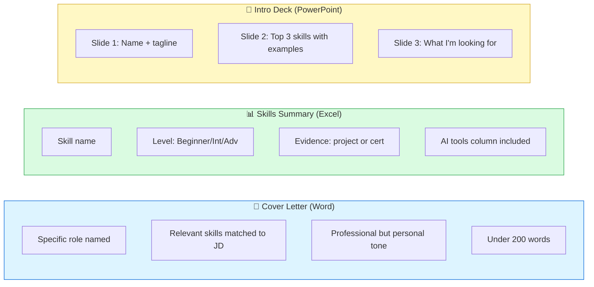
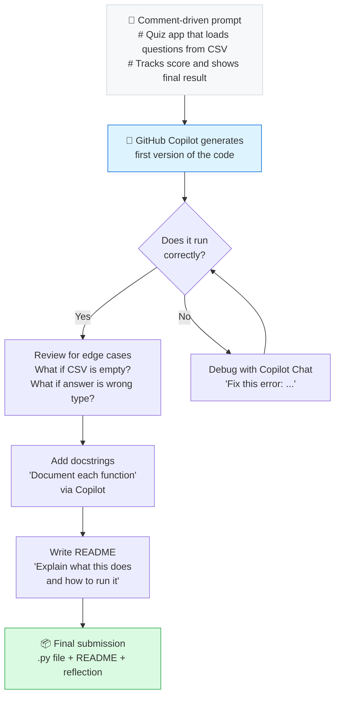
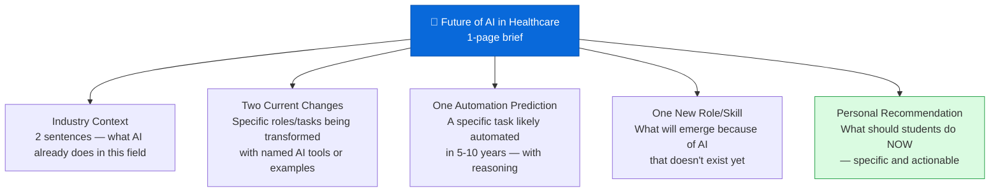
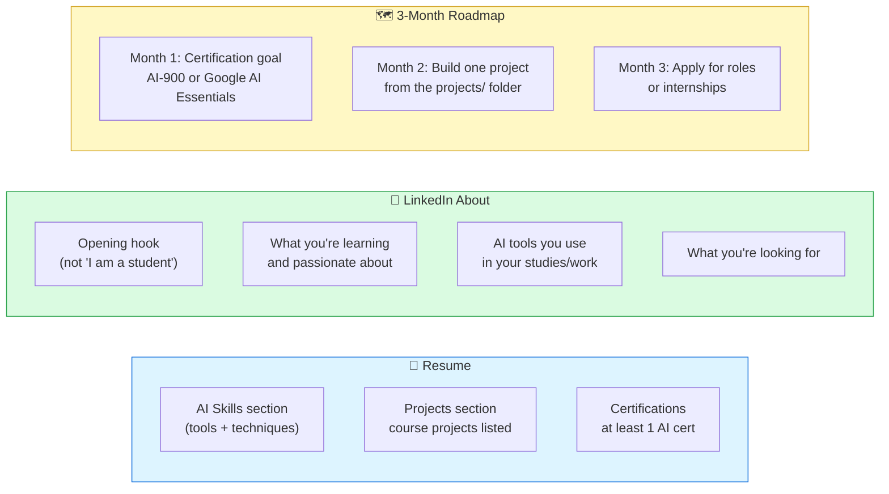

# Sample Answers — Modules 06, 07, 09 & 10

These modules involve practical deliverables (documents, code, presentations, career packs) rather than written essays, so the sample answers focus on **what excellent work looks like** with annotated rubric guidance and key diagrams.

---

## Module 06 — Internship Application Package

**What excellent work looks like:**



**Key differentiators for an A grade:**
- Cover letter references a specific company and role — not a template
- Skills table includes AI tools (Copilot, ChatGPT, GitHub Copilot) with evidence
- Intro deck has a clear personal brand, not just a list of facts
- Student documents which parts were AI-generated and which were personalised

<div class="tip-box">
<strong>💡 Examiner Tip:</strong> The most common weakness is submitting verbatim Copilot output without personalisation. If the cover letter could belong to any student, it scores in the C range. Personalisation is what separates a B from an A.
</div>

---

## Module 07 — AI-Assisted Mini Project

**What excellent work looks like — Python Quiz App example:**



**Reflection — what to document:**
- What % of code did Copilot generate? (be honest — 70%+ is fine)
- What did you have to fix? (typos, logic errors, missing edge cases)
- What did you learn from reviewing the AI's code?
- Would you have built this without AI assistance? How long would it have taken?

<div class="tip-box">
<strong>💡 Examiner Tip:</strong> A student who submits Copilot-generated code with a thoughtful reflection that identifies 3 specific errors they caught scores higher than a student who writes everything manually but submits no reflection. The assignment measures AI literacy, not just coding ability.
</div>

---

## Module 09 — Future of AI Industry Brief

**Structure of an excellent 1-page brief:**



**Example of a strong personal recommendation (Healthcare):**
> "Students entering healthcare should enrol in at least one AI in Medicine course (e.g., Stanford's AI in Healthcare on Coursera) before graduation. Learning to interpret AI-generated diagnostic suggestions — not just trust them — will be a baseline clinical competency within a decade."

**Example of a weak recommendation (scores 0/2):**
> "Students should learn about AI and prepare for changes in their field."

<div class="tip-box">
<strong>💡 Examiner Tip:</strong> The recommendation is the most valuable section to the student's future employer — it shows independent thinking. Vague advice scores 0. Specific, evidenced recommendations (name the course, the certification, the skill) score 2/2.
</div>

---

## Module 10 — AI Career Starter Pack

**What excellent work looks like:**



**Strong AI Skills section example for resume:**

```
AI & Productivity Tools
• Generative AI: ChatGPT (GPT-4o), Microsoft Copilot, Claude
• Prompt Engineering: zero-shot, few-shot, chain-of-thought
• AI Coding: GitHub Copilot (Python, JavaScript)
• Microsoft 365 Copilot: Word, Excel, PowerPoint, Teams
• ML Tools: Google Colab, Kaggle, Teachable Machine
• Certifications: Microsoft AI-900 (in progress)
```

<div class="tip-box">
<strong>💡 Examiner Tip:</strong> "Familiar with AI tools" is the weakest possible AI skills entry — every student can write that. Name the specific tools, name the techniques, and where possible name a project where you used them. Recruiters scan résumés in 6 seconds — specificity is what stops the scroll.
</div>
