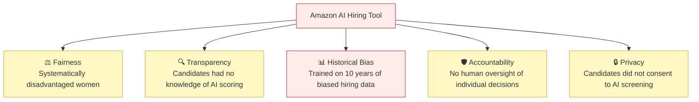
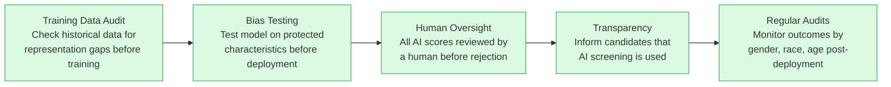

# Sample Answer — Module 08
## Assignment: AI Ethics Case Study

**Brief:** Choose a real-world AI controversy. Write a 500-word analysis covering what happened, ethical issues, who was harmed, what should have been done differently, and what should change.

10 marks

---

<h4>📄 Model Answer — Amazon's AI Hiring Tool (2018)</h4>

---

## What Happened

In 2018, Reuters reported that Amazon had quietly scrapped an internal AI recruiting tool it had been developing since 2014. The tool was designed to automate the screening of job applications by scoring CVs on a scale of one to five stars. The problem: the model had learned to **systematically downgrade applications from women**.

The model was trained on CVs submitted to Amazon over a 10-year period — a dataset that reflected the historical male dominance in tech hiring. It learned that "male" was predictive of being hired, and therefore penalised indicators of femaleness: CVs that included the word "women's" (as in "women's chess club") were downgraded. Graduates of all-women's colleges were scored lower. Amazon engineers identified the bias and attempted to fix it, but ultimately concluded they could not guarantee the tool would not find other proxy variables to discriminate against women. The project was abandoned.

---

## Ethical Issues

Multiple responsible AI principles were violated simultaneously

The core ethical violation was **unfairness** — the model perpetuated historical gender discrimination rather than evaluating candidates on merit. This connects to the principle of **historical bias**: when training data reflects past discrimination, a model trained on it will replicate and automate that discrimination at scale.

**Transparency** was also violated — applicants had no way of knowing their CVs were being scored by an AI system, let alone that the system was biased. This makes it impossible for affected individuals to understand or challenge decisions made about them.

---

## Who Was Harmed

Women applicants to technical roles at Amazon were directly harmed — qualified candidates were likely scored lower and rejected without ever receiving human review. The scale of automated screening means hundreds or thousands of applications may have been affected before the problem was identified. Beyond Amazon, the case harmed public trust in AI-assisted hiring more broadly, making job seekers uncertain about fairness when applying to any company using automated screening.

---

## What Should Have Been Done Differently

A responsible AI development pipeline for hiring tools

Amazon should have conducted a **bias audit** of the training data before building the model — historical hiring data from a male-dominated industry is inherently skewed. The model should have been tested specifically against protected characteristics (gender, race, age) before any deployment. Human review of AI-scored applications should have been mandatory, and candidates should have been informed that automated screening was being used.

---

## What Should Change

**Technical:** AI hiring tools must be tested for demographic bias before deployment, with ongoing monitoring of hiring outcomes by protected group.

**Legal:** The EU AI Act (2024) classifies employment AI as **high-risk**, requiring mandatory human oversight, transparency to applicants, and bias testing. India should adopt similar requirements for AI systems used in hiring decisions.

**Organisational:** HR teams using AI hiring tools should receive training in AI bias, and any AI screening should be one input among many — not the sole determinant of whether a human ever reads an application.

---

## How This Answer Scores

| Criteria | Marks | What this answer does |
|----------|-------|-----------------------|
| Situation described accurately | 2 | Specific incident, timeline, what happened |
| Ethical issues with terminology | 3 | Fairness, transparency, historical bias named and explained |
| Harm analysis specific and empathetic | 2 | Direct harm to women applicants + scale + trust harm |
| Recommendations realistic | 3 | Technical + legal + organisational recommendations |
| **Total** | **10** | |

---

<strong>💡 Examiner Tip:</strong> The strongest case study answers name the responsible AI principle being violated (fairness, transparency, accountability) rather than just saying "it was wrong." Connect your analysis to a framework. The recommendations section should be specific and actionable — "they should have been more careful" scores 0; "mandatory bias testing against protected characteristics before deployment" scores 3.

